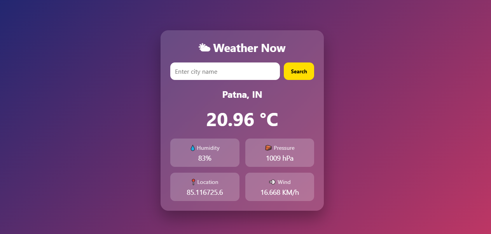

# Weather App (Django)

A full-stack weather web application built using **Django** that provides real-time weather information for any city through API integration.

---

## Overview

This project allows users to search for a city and view real-time weather data such as temperature, humidity, pressure, and wind speed.

The application uses **Django as backend** to fetch and process API data and display it dynamically on the frontend.

---

## Features

- Search weather by city name
- Real-time data using weather API
- Displays:
  - Temperature (°C)
  - Humidity (%)
  - Pressure (hPa)
  - Wind Speed (km/h)
- Clean and modern UI design
- Responsive layout

---

## Screenshots

### Weather Dashboard

---

## Tech Stack

### Backend
- Django (Python)

### Frontend
- HTML
- CSS
- JavaScript

### API
- Weather API (OpenWeatherMap or similar)

---

## Project Structure
weather-app/
├── weather_project/
├── weather_app/
├── templates/
├── static/
├── assets/
│ └── screenshot.png
├── manage.py

---

## How It Works

1. User enters a city name  
2. Request is sent to Django backend  
3. Django fetches weather data from API  
4. Data is processed and sent to template  
5. Weather information is displayed on UI  

---

---

## What I Learned

- Working with APIs in Django  
- Handling user input and backend processing  
- Rendering dynamic data using templates  
- Designing responsive UI  
- Structuring a full-stack project  

---

## Author

**Harikishor Sahu**  
Computer Science & Data Analytics Student (IIT Patna)  
Aspiring Data Scientist / Machine Learning Engineer  

---

*This project demonstrates full-stack development using Django with real-time API integration.*
